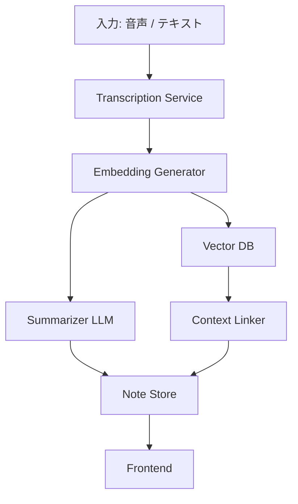
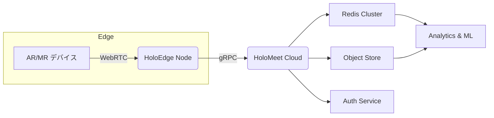

# 概要

今回はCloudflareのAutoRAGという名前の通りRAG周りを自動化してくれるサービスを使って簡易的な検索や、チャットボットをCloudflare Workers で作ってみました！

## AutoRagとは?

https://developers.cloudflare.com/autorag/

> AutoRAGはCloudflareの完全管理型RAGパイプラインで、データ取込→分割→ベクトル化→検索→生成を一括自動化する。VectorizeとWorkers AIを活用し、数分で自社データ対応の生成AIを構築でき、再インデックスやインフラ運用も不要

現時点(2025年6月)ではまだベータ版の状態で、データの取り込み先もR2だけですが、ゆくゆくは「Webクローラー」や「D1」からの取り込みもできる様になりそうです。

使い方としては、R2に用意したデータを自動で取り込んでベクトル化してVectorizeに保存しといてくれて、継続的にインデックス化をしといてくれる優れものです。

## 今回実装するチャットボットの構成

今回は2つの異なる2つの架空のプロダクトの質問を受け付けてくれるチャットボットを作成してみたいと思います。架空のプロダクトはLLMに考えてもらいました。

1. **NeuroNote X**
:::details プロダクト資料

# NeuroNote X

AI を活用した “思考の自動整理ノート”。脳内で浮かんだアイデアやタスクを瞬時にテキスト化し、タグ付け・要約・関連付けまで行うことで **「考える時間を創造する」** 次世代ノートアプリです。

---

## 目次

1. 製品概要
2. 主な機能
3. アーキテクチャ
4. 仕様
5. 導入方法
6. よくある質問（FAQ）
7. ライセンス
8. 料金プラン

---

## 1. 製品概要

- **プロダクト名**：NeuroNote X
- **カテゴリ**：AI ノート / 知的生産支援ツール
- **ターゲット**：研究者・開発者・クリエイター・ビジネスパーソン
- **コア価値**
  - “頭の中” を即座にデジタル化し、関連情報を自動で結びつける
  - 書く・探す・整理する時間を大幅に削減
  - 思考の軌跡を可視化し、再発見や発想転換を促進

---

## 2. 主な機能

### 2.1 リアルタイム音声キャプチャ

- マイクやウェアラブル端末経由で音声を常時待機
- ノイズ抑制と個人辞書により高精度で文字起こし

### 2.2 セマンティック要約

- Transformer ベースのモデルで文脈を保った 3 行サマリー生成
- “目的別要約” プリセット（メール向け／ブログ向け 等）を用意

### 2.3 コンテキストリンク

- Embedding で類似度を計算し、過去ノートや外部資料を自動レコメンド
- “ひらめきツリー” ビューで関連ノートをグラフ表示

### 2.4 タスク抽出 & リマインド

- “TODO:” や「〜しなければ」を検知してタスク化
- 期限を推定し、カレンダー／Slack／メールへ通知

### 2.5 プライバシーモード

- オフライン推論対応（M2 Mac & Win on-device）
- ゼロ知識暗号化でサーバ同期時も内容を秘匿

---

## 3. アーキテクチャ



- **LLM**：社内ファインチューニングした 7 B パラメータモデル
- **DB**：PostgreSQL 15、語彙検索は pgvector 拡張
- **インフラ**：Kubernetes（GKE）＋ Cloud SQL ＋ Cloud Storage
- **エッジ**：Cloudflare Workers で CDN & 認証

---

## 4. 仕様

| 項目 | 内容 |
| --- | --- |
| 対応 OS | macOS 12+, Windows 11, iOS 17+, Android 14+ |
| データ容量制限 | 1 TB／ユーザー（プレミアム） |
| 同期速度目安 | 平均 150 ms（国内）、220 ms（海外） |
| 音声入力対応言語 | 日本語・英語・中国語（簡体）・スペイン語 |
| API レート制限 | 100 req/min（Free）、無制限（Enterprise） |

---

## 5. 導入方法

1. 公式サイトからインストーラをダウンロード
2. アカウント作成後、**設定 → 個人辞書** に業界用語を登録
3. デバイスとマイクへの権限を許可
4. “キャプチャ開始” をクリックして利用開始

> Tip: オフライン推論専用モデルは「設定 → AI エンジン → ローカルモデルを優先」で切替。

---

## 6. よくある質問（FAQ）

**Q1. データはどこに保存されますか？**

A. 日本リージョンの Cloud Storage に暗号化（AES-256）して保存されます。オンプレ対応も可能です。

**Q2. 個人情報がモデル学習に使われることは？**

A. ありません。学習用に使用する場合は匿名化オプトイン制を採用しています。

**Q3. チーム共有はできますか？**

A. Enterprise プランでノート共有・共同編集が利用可能です。

---

## 7. ライセンス

NeuroNote X は **EULA-NND v2.3** に基づき提供されます。詳細は `/LICENSE` を参照してください。

---

## 8. 料金プラン

| プラン | 月額 (JPY) | ストレージ | 機能制限 |
| --- | --- | --- | --- |
| Free | 0 | 5 GB | 1 デバイス / API 30 req/min |
| Pro | 980 | 100 GB | 全機能・5 デバイス |
| Premium | 2,480 | 1 TB | ローカル推論モデル / 優先サポート |
| Enterprise | お問い合わせ | 無制限 | SSO / SLA 99.9 % / 専用サーバ |

:::

2. **HoloMeet Pro**
:::details プロダクト資料

# HoloMeet Pro

- 「距離ゼロの共同作業」を実現する、次世代の *AR／MR コラボレーション・プラットフォーム。

物理空間に 3D オブジェクトやホワイトボードを投影しながら、離れた相手とリアルタイムで設計・レビュー・トレーニングを行えます。

---

## 目次

1. 製品概要
2. 主な機能
3. システム構成
4. 技術仕様
5. 導入手順
6. FAQ
7. ライセンス
8. 料金プラン

---

## 1. 製品概要

| 項目 | 内容 |
| --- | --- |
| プロダクト名 | **HoloMeet Pro** |
| カテゴリ | AR/MR コラボレーション SaaS |
| 想定ユースケース | 製造ライン設計・建築 BIM レビュー・遠隔医療トレーニング・教育実習 |
| 提供形態 | クラウド＋エッジ（オンプレ構成も可） |
| コアバリュー | 超低遅延 3D 同期・空間アンカー共有・マルチデバイス相互運用 |

---

## 2. 主な機能

### 2.1 マルチデバイス空間共有

- Meta Quest / HoloLens / iPad LiDAR / WebXR ブラウザに同一セッションで参加
- **Spatial Anchor v2** で誤差 ≤ 5 mm の位置合わせ

### 2.2 インタラクティブ 3D ホワイトボード

- ボクセル・メッシュ描画に対応
- 手描き線と 3D モデルの衝突を自動補正

### 2.3 自動バージョン管理

- スナップショットごとに Git-like 差分管理（glTF + JSON）
- 「時間巻き戻し」タイムラインで変更点を可視化

### 2.4 ジェスチャー翻訳 & 音声字幕

- 骨格トラッキングで身振りをテキストに変換 → 翻訳字幕を AR オーバーレイ
- 37 言語対応、平均レイテンシ 280 ms

### 2.5 秘匿共有モード

- E2EE + ホモモルフィック暗号でクラウド側にモデルを復号させない設計
- 軍事・医療向けコンプライアンス（HIPAA／ITAR）オプション

---

## 3. システム構成



- **低遅延通信**: WebRTC + QUIC（平均 RTT 45 ms 日本国内）
- **3D データ**: glTF / USDZ / IFC 変換パイプライン内蔵
- **拡張性**: プラグイン SDK（TypeScript / Rust FFI）で UI 拡張可能

## 4. 技術仕様

| 区分 | 内容 |
| --- | --- |
| 同期スケール | 最大 50 クライアント / セッション |
| 空間解像度 | 0.5 cm ボクセル・64 層深度マップ |
| 推論モデル | JetStream-AR (1.1 B params) |
| データ保持期間 | 90 日（Free）／ 3 年（Enterprise） |
| API レート制限 | 150 req/min（Free）・無制限（Paid） |
| セキュリティ | ISO / IEC 27001・SOC 2 Type II 準拠 |

---

## 5. 導入手順

1. 公式サイト で組織アカウント作成
2. **HoloEdge Node** をオンプレ or VM（Ubuntu 22.04）へ `curl | bash` でセットアップ
3. 管理ダッシュボードで **デバイス登録 QR** を発行し、各デバイスで読み込む
4. **「新規セッション → 空間スキャン開始」** をタップして利用開始

> Tip: Edge Node を設置できない場合は、Cloud Relay モードに切替え可能です。

---

## 6. FAQ

**Q1. HoloLens 1 はサポートしていますか？**

A. 現行 v2.3 以降は HoloLens 2 以上が対象です。旧デバイス向けには LTS 版 v1.9 をご利用ください。

**Q2. オフラインで使えますか？**

A. Edge Node と同一 LAN 内であればクラウド接続なしでもセッションが成立します。

**Q3. CAD ファイルは読み込めますか？**

A. STEP／IGES をサーバ側で glTF へ変換し、縮尺を保持したまま表示できます。

---

## 7. ライセンス

HoloMeet Pro は **Commercial Source License v1.4** の下で提供されます。詳細は `/LICENSE` を参照してください。

---

## 8. 料金プラン

| プラン | 月額 (JPY) | Edge Node | ストレージ | 同期上限 | サポート |
| --- | --- | --- | --- | --- | --- |
| Free | 0 | 0 | 5 GB | 5 人 | コミュニティのみ |
| Team | 8,800 | 1 | 200 GB | 20 人 | メール & チャット |
| Business | 29,800 | 3 | 2 TB | 50 人 | 6 h SLA |
| Enterprise | お問い合わせ | 無制限 | 無制限 | 無制限 | 24 h × 365 電話 |

:::


# 準備

## R2バケットの作成

Cloudflareのダッシュボードから「R2 オブジェクト ストレージ」>「バケットを作成する」からAutoRagの取り込み先のバケットを用意しときます。今回は `autorag-chatbot-ex` という名前で作成しました。


## データのアップロード

https://developers.cloudflare.com/autorag/how-to/multitenancy/

AutoRAGはマルチテナントをサポートしています。

> テナントごとにコンテンツをセグメント化することでマルチテナントをサポートし、各ユーザー、顧客、またはワークスペースは自身のデータにのみアクセスできるようにします。これは通常、ドキュメントをテナントごとのフォルダに整理し、クエリ時にメタデータフィルターを適用することで実現されます

引用にもある通り、ドキュメントをテナント毎のフォルダに整理し、クエリ時にフィルターかけることで実現できます。

そこで今回は先ほどの2つの架空のプロダクト毎にフォルダを作成し、その中にドキュメントを作成します。手元のPCで以下の構造でフォルダと先ほどのLLMが考えてくれたドキュメントを設置し、各フォルダをR2へアップロードします。

```bash
 .
 ├─ NeuroNote_X
 │  └─ OVERVIEW.md
 └─ HoloMeet_Pro
    └─ OVERVIEW.md
```

👇アップロードされた様子


一旦これでデータの準備ができました！

# AutoRAGを作成・設定する

次にいよいよメインのAutoRAGを作成していきます。Cloudflareダッシュボードでサイドメニューの「AI」>「AutoRAG」から「AutoRAGを作成する」を選択します。


「データソースを接続する」で先ほど作成したバケットを選択します。


「インデックスを作成する」でモデルを選択します。


現時点(2025年7月)では以下の2つの中からしか選べない様です。

| 項目 | **bge-m3** | **bge-large-en-v1.5** |
| --- | --- | --- |
| 対応言語 | 100 以上の多言語 | 英語のみ |
| 最大入力トークン | 8192 tokens | 512 tokens |
| 出力ベクトル次元 | 1 024 dims | 1 024 dims |
| 推定パラメータ数 | ≈ 568 M params | ≈ 335 M params |
| 料金 (入力 100 万 tokens) | **US $ 0.012** (最安) | **US $ 0.204** |
| 1 分あたり RPS 上限 | 3 000 rpm (Text Embeddings の既定) | 1 500 rpm (個別制限) |
| 主な強み | Dense＋Sparse＋Multi-vector を単一モデルで提供。長文 RAG・多言語検索に最適。 | 英語ドメインで高精度の検索／クラスタリング。既存 RAG 例が多く導入容易。 |
| 主な弱み | モデルが大きく英語単独の精度は v1.5 に及ばないケースあり。 | トークン上限が短く多言語非対応、料金が高め。 |

今回はデフォルト( `bge-m3` )を選択しました。またチャンク関連はデフォルト設定のままにしてます。

次に「**取得と生成を構成する**」ではWorker AI上でVectorizeからのデータ読み込みと、レスポンスを生成するモデルを選択します。デフォルトの `@cf/meta/llama-3.3-70b-instruct-fp8-fast` を選択しました。


ちなみに現時点(2025年6月)表示されているモデルの概要は以下になります。

| モデル | 最大コンテキスト長 | Batch / Function Call | 料金(USD / 1 M tokens) | 代表ユースケース |
| --- | --- | --- | --- | --- |
| **@cf/meta/llama-3.3-70b-instruct-fp8-fast** | 24,000 tokens | ✅ / ✅  | $0.29 per M input tokens, $2.25 per M output tokens | 高精度チャット、少量 but 高品質 RAG |
| **@cf/meta/llama-3.1-8b-instruct-fast** | 128,000 tokens | *未掲載* | *未掲載* | 超長文チャット、多言語 FAQ ボット |
| **@cf/meta/llama-3.1-8b-instruct-fp8** | 32,000 tokens | *未掲載* | $0.15 per M input tokens, $0.29 per M output tokens | 低コスト Q&A、リアルタイム補助 |
| **@cf/meta/llama-4-scout-17b-16e-instruct** | 131,000 tokens | ✅ / ✅ | $0.27 per M input tokens, $0.85 per M output tokens | 画像付きチャット、100 k+ 要約／分析 |

:::message
ドキュメントではクエリ時にモデルを指定できるようなオプションが書かれていますが `wrangler: 4.23.0` のバージョンでは `wrangler types` で生成した `worker-configuration.d.ts` にはそんなオプションが存在しませんでした。(ここら辺分かる方教えてもらえると助かります)

[Workers Binding](https://developers.cloudflare.com/autorag/usage/workers-binding/#aisearch)
:::

また、Workers AI が用意しているモデルだけでなく、レスポンス生成時に使用するモデルに関しては他のモデル(例 OpenAIのモデルなど) を使用できます。

https://developers.cloudflare.com/autorag/how-to/bring-your-own-generation-model/

他の項目はデフォルトのままで「次へ」を選択し、AutoRagの名前を設定し他はデフォルトのまま「作成」します。名前は今回は `autorag-chatbot-ex` にしました。


作成が完了すると以下の様に「Vector Database」が作成され自動でR2バケットに指定したデータが読み込まれています。


この後にR2バケットにドキュメントの更新があれば定期的に監視してくれて、自動で「Vector Database」が更新されます。

# プレイグラウンドで試してみる

AutoRAGにはプレイグラウンドがあるので反映されているか軽く確かめてみます。


※ ちなみに「NeuroNote Xを参照してください。」のリンク先は何も見れませんでした。


ちゃんとデータは反映されていそうです！

# アプリを実装する

次にチャットボットで先ほど作成したAutoRAGとやりとりする簡単なアプリを実装してみたいと思います。

## 構成

Cloudflare Workersではフロントエンドもバックエンドも両方いけるので、今回は 「Vite + React + Hono」の構成で実装を進めていきます。

https://blog.cloudflare.com/ja-jp/full-stack-development-on-cloudflare-workers/

## 動作環境

https://github.com/Slowhand0309/nodejs-devcontainer-boilerplate

👆こちらの環境をベースに進めていきます。

## セットアップ

Vite + React + Hono構成のテンプレートを使ってプロジェクトを作成します。

```bash
yarn create cloudflare app --template=cloudflare/templates/vite-react-template
```

※ git管理とdeployは `NO` にしました。

プロジェクトが作成されたら、早速起動してみます。

まずは `.devcontainer/compose.yaml` にポートを追加します。

```yaml
services:
  app:
    # ...
    ports:
      - 5173:5173
```

次に `app/package.json` の `scripts` > `dev` を以下に修正します。

```yaml
 {
  ...
  "scripts": {
    ...
    "dev": "vite --host=0.0.0.0",
  },
}
```

これで準備ができたので早速起動してみます。

```bash
$ cd app
$ yarn install
$ yarn dev
```

うまく起動できて [http://localhost:5173](http://localhost:5173) にアクセスして以下が表示されとけばOKです。


## Cloudflareログイン

以下を実施して、事前にCloudflareにログインしときます。

```bash
yarn wrangler login
```

※ コンテナ上で実施する場合、[こちら](https://zenn.dev/frog/articles/f77b80a0d78497)を参考にログイン実施できます。

以下でログイン状況を確認できます。

```bash
yarn wrangler whoami
```

## Bindings設定

次に `app/wrangler.json` に [Workers AI](https://developers.cloudflare.com/workers-ai/configuration/bindings/) のBindingを追加します。

```json
{
  // ...
  },
  "ai": {
    "binding": "AI"
  }
}
```

追加したら以下を実施して `app/worker-configuration.d.ts` を更新しときます。

```bash
yarn cf-typegen
```

## シンプルな検索の実装

まずはシンプルにパラメータで質問を投げたら返答を返すAPIを実装してみます。

`app/src/worker/index.ts` に以下を追加します。

```tsx
app.get("/query", async (c) => {
  const query = c.req.query("query");
  if (!query) {
    return c.json({ error: "Query parameter is required" }, 400);
  }

  try {
    const result = await c.env.AI.autorag("autorag-chatbot-ex").aiSearch({
      query,
      rewrite_query: true,
    });
    return c.json(result);
  } catch (error) {
    console.error("AutoRAG query failed:", error);
    return c.json({ error: "Failed to process query" }, 500);
  }
});
```

`AI.autorag` を使ってAutoRAGの機能を使います。引数には先ほどダッシュボード上で作成した `autorag-chatbot-ex` を指定しています。

検索には以下の2通りあります。

1. [aiSearch](https://developers.cloudflare.com/autorag/usage/workers-binding/#aisearch)
    - データソースから関連する結果を検索し、指定したAutoRAGのデフォルトモデルと検索されたコンテキストを使用してレスポンスを生成します
2. [search](https://developers.cloudflare.com/autorag/usage/workers-binding/#search)
    - データソースから関連する結果を検索し、関連する結果を返します

単に結果を返す `search` とは違って `aiSearch` だと指定したモデルでレスポンスを作成してくれます。

次にフロント側からこのAPIを呼び出す画面を実装します。

`app/src/react-app/App.tsx` を以下に修正します。

:::details App.tsx

```tsx
// src/App.tsx

import { useState } from "react";
import "./App.css";

interface AutoRagResult {
  object: string;
  search_query: string;
  response: string;
  data: {
    file_id: string;
    filename: string;
    score: number;
    attributes: Record<string, unknown>;
    content: unknown[];
  }[];
  has_more: boolean;
  next_page: string | null;
}

function App() {
  const [query, setQuery] = useState("");
  const [result, setResult] = useState<AutoRagResult | null>(null);
  const [loading, setLoading] = useState(false);
  const [error, setError] = useState<string | null>(null);

  const handleQuery = async () => {
    if (!query.trim()) return;

    setLoading(true);
    setError(null);
    setResult(null);

    try {
      const response = await fetch(`/query?q=${encodeURIComponent(query)}`);
      if (!response.ok) {
        throw new Error("Failed to fetch");
      }
      const data = await response.json();
      setResult(data);
    } catch {
      setError("Failed to process query");
    } finally {
      setLoading(false);
    }
  };

  return (
    <>
      <h1>AutoRAG Query & Chat</h1>

      <div
        style={{
          display: "flex",
          gap: "2rem",
          maxWidth: "1200px",
          margin: "0 auto",
        }}
      >
        <div style={{ flex: 1 }}>
          <h2>Search</h2>
          <div className="card">
            <div style={{ marginBottom: "1rem" }}>
              <input
                type="text"
                value={query}
                onChange={(e) => setQuery(e.target.value)}
                placeholder="Enter your query..."
                style={{
                  padding: "0.5rem",
                  fontSize: "1rem",
                  width: "300px",
                  marginRight: "0.5rem",
                }}
              />
              <button
                onClick={handleQuery}
                disabled={loading || !query.trim()}
                style={{
                  padding: "0.5rem 1rem",
                  fontSize: "1rem",
                }}
              >
                {loading ? "Searching..." : "Search"}
              </button>
            </div>
            {error && (
              <div style={{ color: "red", marginBottom: "1rem" }}>
                Error: {error}
              </div>
            )}
            {result && (
              <div
                style={{
                  textAlign: "left",
                  maxWidth: "800px",
                  margin: "0 auto",
                }}
              >
                <h3>Response:</h3>
                <p
                  style={{
                    color: "black",
                    background: "#f5f5f5",
                    padding: "1rem",
                    borderRadius: "4px",
                    lineHeight: "1.6",
                  }}
                >
                  {result.response}
                </p>

                {result.data && result.data.length > 0 && (
                  <div style={{ marginTop: "2rem" }}>
                    <h4>Sources ({result.data.length} documents):</h4>
                    {result.data.map((source) => (
                      <div
                        key={source.file_id}
                        style={{
                          color: "black",
                          background: "#f9f9f9",
                          padding: "1rem",
                          marginBottom: "1rem",
                          borderRadius: "4px",
                          border: "1px solid #e0e0e0",
                        }}
                      >
                        <div
                          style={{
                            display: "flex",
                            justifyContent: "space-between",
                            alignItems: "center",
                            marginBottom: "0.5rem",
                          }}
                        >
                          <strong>{source.filename}</strong>
                          <span style={{ fontSize: "0.9em", color: "#666" }}>
                            Score: {(source.score * 100).toFixed(1)}%
                          </span>
                        </div>
                        <div
                          style={{
                            fontSize: "0.9em",
                            color: "#666",
                            marginBottom: "0.5rem",
                          }}
                        >
                          File ID: {source.file_id}
                        </div>
                        {source.content && source.content.length > 0 && (
                          <div>
                            <strong>Content:</strong>
                            <div
                              style={{ marginTop: "0.5rem", fontSize: "0.9em" }}
                            >
                              {Array.isArray(source.content)
                                ? source.content
                                    .map((c) => JSON.stringify(c, null, 2))
                                    .join(" ")
                                : String(
                                    JSON.stringify(source.content, null, 2)
                                  )}
                            </div>
                          </div>
                        )}
                      </div>
                    ))}
                  </div>
                )}

                <div
                  style={{
                    marginTop: "1rem",
                    fontSize: "0.9em",
                    color: "#666",
                  }}
                >
                  <div>Search Query: "{result.search_query}"</div>
                  {result.has_more && <div>More results available...</div>}
                </div>
              </div>
            )}
          </div>
        </div>
      </div>
    </>
  );
}

export default App;
```

:::

やっている事としては「Search」ボタンが押されると入力された内容を先ほど作成した `/query` APIに投げてレスポンスを表示しています。


👆ちゃんと検索できてそうです。

## チャットボットの実装

やっと本題のチャットボットの実装になります。先ほど同様に `app/src/worker/index.ts` にチャットボットとのやり取りを行うAPIを追加します。

```tsx
app.post("/chat", async (c) => {
  try {
    const body = await c.req.json();
    const { query, messages } = body;

    if (!query) {
      return c.json({ error: "Query parameter is required" }, 400);
    }

    return streamText(c, async (stream) => {
      let contextQuery = query;

      if (messages && messages.length > 0) {
        const recentMessages = messages.slice(-6);
        const context = recentMessages
          .map(
            (msg: { role: string; content: string }) =>
              `${msg.role}: ${msg.content}`
          )
          .join("\n");
        contextQuery = `Previous conversation:\n${context}\n\nCurrent question: ${query}`;
      }

      const result = await c.env.AI.autorag("autorag-chatbot-ex").aiSearch({
        query: contextQuery,
        rewrite_query: true,
      });

      if (result && result.response) {
        stream.write(result.response);
      }
    });
  } catch (error) {
    console.error("AutoRAG chat failed:", error);
    return c.json({ error: "Failed to process chat" }, 500);
  }
});
```

やっている事としては先ほど同様 `aiSearch` を使っているのは変わらず、パラメータに検索文字とは別に今までのチャットボットとのやり取りを `messages` として渡しています。

早速フロント側も実装してAPIと繋ぎ込んでみます。

:::details App.tsx

```tsx
// src/App.tsx

import { useEffect, useRef, useState } from "react";
import "./App.css";

// ...

// 以下追加
interface ChatMessage {
  role: "user" | "assistant";
  content: string;
}

function App() {
  
  // 以下追加
  const [chatMessages, setChatMessages] = useState<ChatMessage[]>([]);
  const [chatInput, setChatInput] = useState("");
  const [chatLoading, setChatLoading] = useState(false);
  const [currentResponse, setCurrentResponse] = useState("");
  const messagesEndRef = useRef<HTMLDivElement>(null);

  const handleChat = async () => {
    if (!chatInput.trim()) return;

    const userMessage: ChatMessage = { role: "user", content: chatInput };
    setChatMessages((prev) => [...prev, userMessage]);
    setChatInput("");
    setChatLoading(true);
    setCurrentResponse("");

    try {
      const response = await fetch("/chat", {
        method: "POST",
        headers: {
          "Content-Type": "application/json",
        },
        body: JSON.stringify({
          query: chatInput,
          messages: chatMessages,
        }),
      });
      if (!response.ok) {
        throw new Error("Failed to fetch chat response");
      }

      const reader = response.body?.getReader();
      if (!reader) throw new Error("No reader available");

      let fullResponse = "";
      while (true) {
        const { done, value } = await reader.read();
        if (done) break;

        const chunk = new TextDecoder().decode(value);
        fullResponse += chunk;
        setCurrentResponse(fullResponse);
      }

      const assistantMessage: ChatMessage = {
        role: "assistant",
        content: fullResponse,
      };
      setChatMessages((prev) => [...prev, assistantMessage]);
      setCurrentResponse("");
    } catch {
      const errorMessage: ChatMessage = {
        role: "assistant",
        content: "Sorry, I encountered an error processing your message.",
      };
      setChatMessages((prev) => [...prev, errorMessage]);
    } finally {
      setChatLoading(false);
    }
  };

  useEffect(() => {
    messagesEndRef.current?.scrollIntoView({ behavior: "smooth" });
  }, [chatMessages, currentResponse]);

  return (
    <>
      <h1>AutoRAG Query & Chat</h1>

      <div
        style={{
          display: "flex",
          gap: "2rem",
          maxWidth: "1200px",
          margin: "0 auto",
        }}
      >
        {/* 以下追加 */}
        <div style={{ flex: 1 }}>
          <h2>Chat</h2>
          <div
            className="card"
            style={{
              height: "600px",
              display: "flex",
              flexDirection: "column",
            }}
          >
            <div
              style={{
                flex: 1,
                overflowY: "auto",
                border: "1px solid #e0e0e0",
                borderRadius: "4px",
                padding: "1rem",
                marginBottom: "1rem",
                backgroundColor: "#fafafa",
                color: "#333",
              }}
            >
              {chatMessages.map((message, index) => (
                <div
                  key={index}
                  style={{
                    marginBottom: "1rem",
                    padding: "0.75rem",
                    borderRadius: "8px",
                    backgroundColor:
                      message.role === "user" ? "#e3f2fd" : "#f5f5f5",
                    marginLeft: message.role === "user" ? "2rem" : "0",
                    marginRight: message.role === "assistant" ? "2rem" : "0",
                    textAlign: message.role === "user" ? "right" : "left",
                  }}
                >
                  <div
                    style={{
                      fontWeight: "bold",
                      marginBottom: "0.25rem",
                      fontSize: "0.9em",
                    }}
                  >
                    {message.role === "user" ? "You" : "Assistant"}
                  </div>
                  <div style={{ whiteSpace: "pre-wrap" }}>
                    {message.content}
                  </div>
                </div>
              ))}

              {chatLoading && currentResponse && (
                <div
                  style={{
                    marginBottom: "1rem",
                    padding: "0.75rem",
                    borderRadius: "8px",
                    backgroundColor: "#f5f5f5",
                    marginRight: "2rem",
                  }}
                >
                  <div
                    style={{
                      fontWeight: "bold",
                      marginBottom: "0.25rem",
                      fontSize: "0.9em",
                    }}
                  >
                    Assistant
                  </div>
                  <div style={{ whiteSpace: "pre-wrap" }}>
                    {currentResponse}
                  </div>
                </div>
              )}

              {chatLoading && !currentResponse && (
                <div
                  style={{
                    marginBottom: "1rem",
                    padding: "0.75rem",
                    borderRadius: "8px",
                    backgroundColor: "#f5f5f5",
                    marginRight: "2rem",
                  }}
                >
                  <div
                    style={{
                      fontWeight: "bold",
                      marginBottom: "0.25rem",
                      fontSize: "0.9em",
                    }}
                  >
                    Assistant
                  </div>
                  <div>Thinking...</div>
                </div>
              )}

              <div ref={messagesEndRef} />
            </div>

            <div style={{ display: "flex", gap: "0.5rem" }}>
              <input
                type="text"
                value={chatInput}
                onChange={(e) => setChatInput(e.target.value)}
                placeholder="Type your message..."
                style={{
                  flex: 1,
                  padding: "0.75rem",
                  fontSize: "1rem",
                  borderRadius: "4px",
                  border: "1px solid #ccc",
                }}
                onKeyDown={(e) =>
                  e.key === "Enter" && !chatLoading && handleChat()
                }
                disabled={chatLoading}
              />
              <button
                onClick={handleChat}
                disabled={chatLoading || !chatInput.trim()}
                style={{
                  padding: "0.75rem 1.5rem",
                  fontSize: "1rem",
                  borderRadius: "4px",
                  backgroundColor: "#007bff",
                  color: "white",
                  border: "none",
                  cursor: chatLoading ? "not-allowed" : "pointer",
                }}
              >
                {chatLoading ? "Sending..." : "Send"}
              </button>
            </div>
          </div>
        </div>
      </div>
    </>
  );
}

export default App;
```

:::


うまく表示されていそうです。

## 動作確認

チャットボットと少しやり取りしてみたいと思います。


やり取りを全部送っているんで、コンテキストがずれずにやり取りできています。

簡単な汎用的な事柄も聞ける様です。


ただこのままだと、2つのプロダクトどちらの内容も聞けるようになってしまっています。


セキュアな情報を扱っている場合だとこの状況はよろしくないので、それぞれのプロダクト専用のチャットボットを作成してみたいと思います。

# マルチテナント対応

マルチテナント対応を実現する為に、Metadata filtering を使用します。

https://developers.cloudflare.com/autorag/configuration/metadata/

先ほどのAPI `/query` 実装を少し修正します。

```tsx
app.get("/query", async (c) => {
  const query = c.req.query("q");
  // 👇新たなtargetパラメータを追加
  const target = c.req.query("target");
  if (!query) {
    return c.json({ error: "Query parameter is required" }, 400);
  }
  if (!target) {
    return c.json({ error: "Target parameter is required" }, 400);
  }

  try {
    const result = await c.env.AI.autorag("autorag-chatbot-ex").aiSearch({
      query,
      rewrite_query: true,
      // 👇追加
      filters: {
        type: "eq",
        key: "folder",
        value: `${target}/`, // 末尾の / が無いと上手くfilterしてくれないので注意!
      },
    });
    return c.json(result);
  } catch (error) {
    console.error("AutoRAG query failed:", error);
    return c.json({ error: "Failed to process query" }, 500);
  }
});
```

`aiSearch` で `filters` を使って特定の `folder` を対象にクエリをかけるように修正しています。

次にフロント側もプロダクトを選べるように修正します。

`app/src/react-app/App.tsx`

```tsx
type Targets = "HoloMeet_Pro" | "NeuroNote_X";

function App() {
  // 👇追加
  const [target, setTarget] = useState<Targets>("HoloMeet_Pro");

  const handleQuery = async () => {
    if (!query.trim()) return;

    setLoading(true);
    setError(null);
    setResult(null);

    try {
      // 👇 targetをクエリパラメータに追加
      const response = await fetch(
        `/query?q=${encodeURIComponent(query)}&target=${target}`
      );
      if (!response.ok) {
        throw new Error("Failed to fetch");
      }
      const data = await response.json();
      setResult(data);
    } catch {
      setError("Failed to process query");
    } finally {
      setLoading(false);
    }
  };
  // ....
  return (
    <>
      <h1>AutoRAG Query & Chat</h1>
      {/* 👇 プロダクトを選択できるように */}
      <div style={{ marginBottom: "1rem" }}>
        <label htmlFor="target">Select Target:</label>
        <select
          id="target"
          value={target}
          onChange={(e) => setTarget(e.target.value as Targets)}
          style={{ marginLeft: "0.5rem", padding: "0.25rem" }}
        >
          <option value="HoloMeet_Pro">HoloMeet Pro</option>
          <option value="NeuroNote_X">NeuroNote X</option>
        </select>
      </div>

      <p>
        Current target: <strong>{target}</strong>
      </p>
      ...
  );
}
```

早速試してみます。


`NeuroNote X` を選択中に `HoloMeet Pro` に関することを聞いてみて、ドキュメントの中には見つからないと言ってますね。うまくフィルタリングできてそうです。


逆に `HoloMeet Pro` のことはちゃんと答えてくれます ✨

今回は簡単なフィルタリングしか使っていませんが、細かいフィルタリングもできる様なので必要あればドキュメントを参照してみて下さい。

# OpenAIのモデルを使ってみる

最後にレスポンス生成する部分で今までWorkers AIの用意されたモデルを使ってきましたが、別のモデルを使ってレスポンスを生成するようにしてみたいと思います。

https://developers.cloudflare.com/autorag/how-to/bring-your-own-generation-model/

👆を元に進めていきます。早速必要なパッケージをインストールします。

```bash
$ cd app
$ yarn add ai @ai-sdk/openai zod@3.23.8
```

:::message alert
※ 手元の環境だと `zod@3.23.8` をバージョン指定で入れとかないと 👇のエラーが出ました…

**vite_ssr_import_0**.z.string(...).base64 is not a function
:::

次に `OPENAI_API_KEY` 環境変数を `app/wrangler.json` に追加します。

```json
"vars": {
  "OPENAI_API_KEY": "<<your api key>>"
}
```

追加したら `yarn cf-typegen` を実行して `app/worker-configuration.d.ts` を更新しときます。

`app/src/worker/index.ts` に新たに `/openai_query` を作成します。

```tsx
app.get("/openai_query", async (c) => {
  const query = c.req.query("q");
  const target = c.req.query("target");
  if (!query) {
    return c.json({ error: "Query parameter is required" }, 400);
  }
  if (!target) {
    return c.json({ error: "Target parameter is required" }, 400);
  }

  try {
    const result = await c.env.AI.autorag("autorag-chatbot-ex").search({
      query,
      rewrite_query: true,
      filters: {
        type: "eq",
        key: "folder",
        value: `${target}/`,
      },
    });
    if (result.data.length === 0) {
      return Response.json({ text: `No data found for query "${query}"` });
    }
    const chunks = result.data
      .map((item) => {
        const data = item.content
          .map((content) => {
            return content.text;
          })
          .join("\n\n");

        return `<file name="${item.filename}">${data}</file>`;
      })
      .join("\n\n");
    const generateResult = await generateText({
      model: openai("gpt-4o-mini"),
      messages: [
        {
          role: "system",
          content:
            "You are a helpful assistant and your task is to answer the user question using the provided files.",
        },
        { role: "user", content: chunks },
        { role: "user", content: query },
      ],
    });
    return c.json(generateResult);
  } catch (error) {
    console.error("AutoRAG query failed:", error);
    return c.json({ error: "Failed to process query" }, 500);
  }
});
```

やっている事としては `search` を使ってデータソースからEmbeddingsされたデータを取得し、それを参照するようにプロンプトを作成してOpenAIのモデルに投げています。

次にフロント側も新規にUIを追加します。

:::details App.tsx

```tsx
function App() {
  // ... 他省略

  const [openaiQuery, setOpenaiQuery] = useState("");
  const [openaiResponse, setOpenaiResponse] = useState<string | null>(null);
  const [openaiLoading, setOpenaiLoading] = useState(false);
  const [openaiError, setOpenaiError] = useState<string | null>(null);
  
  const handleOpenaiQuery = async () => {
    if (!openaiQuery.trim()) return;

    setOpenaiLoading(true);
    setOpenaiError(null);
    setOpenaiResponse(null);

    try {
      const response = await fetch(
        `/openai_query?q=${encodeURIComponent(openaiQuery)}&target=${target}`
      );
      if (!response.ok) {
        throw new Error("Failed to fetch OpenAI response");
      }
      const data = await response.json();
      setOpenaiResponse(data.text);
    } catch {
      setOpenaiError("Failed to process OpenAI query");
    } finally {
      setOpenaiLoading(false);
    }
  };
  
    return (
    <>
      <h1>AutoRAG Query & Chat</h1>
        {/* 他省略 */}
        <div style={{ flex: 1 }}>
          <h2>OpenAI Search</h2>
          <div className="card">
            <div style={{ marginBottom: "1rem" }}>
              <input
                type="text"
                value={openaiQuery}
                onChange={(e) => setOpenaiQuery(e.target.value)}
                placeholder="Enter your query..."
                style={{
                  padding: "0.5rem",
                  fontSize: "1rem",
                  width: "300px",
                  marginRight: "0.5rem",
                }}
              />
              <button
                onClick={handleOpenaiQuery}
                disabled={openaiLoading || !openaiQuery.trim()}
                style={{
                  padding: "0.5rem 1rem",
                  fontSize: "1rem",
                }}
              >
                {loading ? "Searching..." : "Search"}
              </button>
            </div>
            {openaiError && (
              <div style={{ color: "red", marginBottom: "1rem" }}>
                Error: {openaiError}
              </div>
            )}
            {openaiResponse && (
              <div
                style={{
                  textAlign: "left",
                  maxWidth: "800px",
                  margin: "0 auto",
                }}
              >
                <h3>Response:</h3>
                <p
                  style={{
                    color: "black",
                    background: "#f5f5f5",
                    padding: "1rem",
                    borderRadius: "4px",
                    lineHeight: "1.6",
                  }}
                >
                  {openaiResponse}
                </p>
              </div>
            )}
          </div>
        </div>
      </div>
    </>
  );
```

:::

早速クエリをかけてみます。


Workers AIのモデルと比べて細かな説明になった感じでしょうか 👀

汎用的な質問もしてみます。


ChatGPTっぽい(当たり前ですが)ですね！上手く動いてそうです！

# まとめ

AutoRAGがデータの取り込み→ベクトル化→検索を丸っとやってくれるので、結構簡単に簡易的なチャットが構築できました！レスポンス生成の時のモデルもカスタムできるので、好きなモデルでちょっとした検索や、チャットボットを作る分には使えそうだなと感じました。

また、今回試した分は以下リポジトリにPushしています。

https://github.com/Slowhand0309/autorag-chatbot-ex
