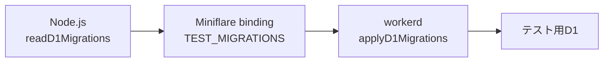

# 概要

Cloudflare Workers 上で動く API をテストするとき、D1 や Durable Object を単純なモックへ置き換えると、本番ランタイム固有の挙動を見落とすことがあります。

今回、Hono・D1・Durable Object を組み合わせた API に対して、`@cloudflare/vitest-pool-workers` を使い、**workerd 内で実際のバインディングを動かすテスト環境**を構築しました。

実装そのものより時間がかかったのは、次のようなバージョン差の理解でした。

- 従来の `defineWorkersConfig()` 方式から、Viteプラグインの `cloudflareTest()` 方式へ移行している

- Node.js側で読み込んだD1マイグレーションを、workerd側へバインディング経由で渡す必要がある

- 以前提供されていた `fetchMock` は、新しいAPIでは削除されている

- D1とDurable Objectでは、テストデータの隔離方法が異なる

この記事では、完成した設定だけでなく、**なぜその設定が必要なのか**を整理します。

> 💡 **今回の方針**

# なぜD1とDurable Objectをモックしないのか

一般的なWeb APIであれば、DBアクセス層をモックして、ビジネスロジックだけを高速にテストする方法も有効です。

しかし、今回のシステムでは以下のような仕組みが設計の中心にありました。

- D1の外部キー・一意制約・トランザクション

- Durable Objectのオブジェクト単位の分離

- Durable Object内の直列実行

- Workerのバインディングを介したD1・DOへのアクセス

- workerd上でのRequest／Response処理

この部分をモックすると、次のような不具合を見逃す可能性があります。

- SQL自体がD1で実行できない

- マイグレーションと実装が食い違っている

- 外部キー制約に違反している

- Durable ObjectのIDや名前の選び方が間違っている

- 通常のNode.jsでは動くが、Workersランタイムでは動かないAPIを使用している

そのため今回は、単体テストというよりも、**Workersランタイム内で行う軽量な結合テスト**として環境を構築しました。

# 新しい設定はcloudflareTestプラグインを使う

以前の `@cloudflare/vitest-pool-workers` では、以下のような設定が多く使われていました。

```typescript
import { defineWorkersConfig } from '@cloudflare/vitest-pool-workers/config'

export default defineWorkersConfig({
  test: {
    poolOptions: {
      workers: {
        wrangler: {
          configPath: './wrangler.jsonc',
        },
      },
    },
  },
})
```

Vitest 4対応で導入された新しいAPIでは、`cloudflareTest()` をViteプラグインとして登録します。

今回使用した `@cloudflare/vitest-pool-workers` 0.19.0でも、このプラグイン方式になっています。

```typescript
// vitest.config.ts
import {
  cloudflareTest,
  readD1Migrations,
} from '@cloudflare/vitest-pool-workers'
import { defineConfig } from 'vitest/config'

const migrations = await readD1Migrations('migrations')

export default defineConfig({
  plugins: [
    cloudflareTest({
      wrangler: {
        configPath: './wrangler.jsonc',
      },
      miniflare: {
        bindings: {
          TEST_MIGRATIONS: migrations,
        },
      },
    }),
  ],
  test: {
    setupFiles: ['./src/test-support/setup.ts'],
  },
})
```

`cloudflareTest()` の設定には、主に以下を指定できます。

- `wrangler`: 読み込むWrangler設定

- `miniflare`: テスト時に上書き・追加するバインディング

- `main`: テスト対象Workerのエントリポイント

0.19.0では、workerdの詳細ログを制御する `verbose` オプションも追加されています。

```typescript
cloudflareTest({
  verbose: false,
  wrangler: {
    configPath: './wrangler.jsonc',
  },
})
```

> 📝 新プラグインAPIは0.19.0で初めて追加されたものではなく、Vitest 4対応の過程で先に導入されています。0.19.0は、そのAPIを利用できる執筆時点のバージョンです。

# ドキュメントより型定義が役に立った

新旧APIが切り替わる時期は、検索で見つかる記事やサンプルが古いことがあります。

今回、最も参考になったのは、インストール済みパッケージの型定義でした。

```plain text
node_modules/
  @cloudflare/
    vitest-pool-workers/
      dist/pool/index.d.mts
```

`cloudflareTest()` の引数を見ると、旧APIの `poolOptions.workers` で指定していた設定と対応関係があることが分かります。

ライブラリの移行期は、次の順で調べると早そうです。

1. 現在インストールされているバージョンを確認する

1. `package.json` の `exports` を確認する

1. `.d.ts` または `.d.mts` で公開APIを確認する

1. 公式リポジトリ内のfixtureやテストコードを探す

1. 最後に過去の記事との差分を確認する

特に薄いラッパーライブラリでは、型定義が実質的な一次情報になっていることがあります。

# D1マイグレーションは2つのランタイムをまたぐ

D1のテスト用DBには、本番と同じマイグレーションを適用したいところです。

ここで混乱しやすいのが、設定ファイルとテストコードは別の環境で動いていることです。

| 処理 | 実行環境 |
| --- | --- |
| `vitest.config.ts` | Node.js |
| テスト・setupFiles・Worker | workerd |

workerd側では、Node.jsの `fs` を使ってローカルのマイグレーションファイルを読むことはできません。

そのため、次の3段階でマイグレーションを渡します。



## Node.js側でSQLを読み込む

```typescript
// vitest.config.ts
const migrations = await readD1Migrations('migrations')
```

## Miniflareのバインディングで渡す

```typescript
cloudflareTest({
  miniflare: {
    bindings: {
      TEST_MIGRATIONS: migrations,
    },
  },
})
```

## workerd側でD1へ適用する

```typescript
// src/test-support/setup.ts
import { applyD1Migrations } from 'cloudflare:test'
import { env } from 'cloudflare:workers'

await applyD1Migrations(env.DB, env.TEST_MIGRATIONS)
```

`applyD1Migrations()` は、適用済みマイグレーションを管理するテーブルを作成し、未適用分だけを順番に実行します。管理テーブル名を省略した場合は `d1_migrations` が使用されます。

# テスト専用バインディングの型を追加する

`wrangler types` が生成する `Cloudflare.Env` には、テスト時だけ存在する `TEST_MIGRATIONS` は含まれません。

グローバル名前空間を拡張して、型を追加します。

```typescript
// src/test-support/env.d.ts
import type { D1Migration } from '@cloudflare/vitest-pool-workers'

declare global {
  namespace Cloudflare {
    interface Env {
      TEST_MIGRATIONS: D1Migration[]
    }
  }
}

export {}
```

`export {}` を付けて、このファイルをモジュールとして扱わせておくと、意図しないグローバルスクリプト化を避けられます。

# fetchMockは新APIでは使えない

外部のIDトークンを検証するため、公開鍵を取得するJWKSエンドポイントだけはモックする必要がありました。

古い記事では、次のようなコードを見かけます。

```typescript
import { fetchMock } from 'cloudflare:test'
```

しかし、新しいプラグインAPIへの移行時に `fetchMock` は削除されています。0.19.0の `cloudflare:test` の公開型にも、`fetchMock` は存在しません。

公式リポジトリのテストでも、`globalThis.fetch` をVitestで直接モックする方法が使われています。

```typescript
import { afterEach, vi } from 'vitest'

const JWKS_URL = 'https://example.com/.well-known/jwks.json'

afterEach(() => {
  vi.restoreAllMocks()
})

vi.spyOn(globalThis, 'fetch').mockImplementation(
  async (input: RequestInfo | URL, init?: RequestInit) => {
    const request = new Request(input, init)

    if (request.url === JWKS_URL && request.method === 'GET') {
      return Response.json({ keys: [jwk] })
    }

    throw new Error(`テストが想定していない外部fetch: ${request.url}`)
  },
)
```

`vi.stubGlobal()` でも実現できます。

```typescript
vi.stubGlobal(
  'fetch',
  vi.fn(async (input: RequestInfo | URL) => {
    const url = input instanceof Request ? input.url : String(input)

    if (url === JWKS_URL) {
      return Response.json({ keys: [jwk] })
    }

    throw new Error(`テストが想定していない外部fetch: ${url}`)
  }),
)
```

`spyOn()` は元の関数を追跡しやすく、`restoreAllMocks()` で復元できます。`stubGlobal()` を使う場合は、`vi.unstubAllGlobals()` またはVitestの設定で確実に元へ戻します。

重要なのは、モック対象以外を黙って実通信させないことです。

```typescript
throw new Error(`テストが想定していない外部fetch: ${url}`)
```

これにより、実装変更で外部通信が増えた場合もすぐ気づけます。

> 🌐 外部HTTP境界だけをモックし、D1バインディングやDurable Objectは実ランタイムのまま動かします。これにより、テストの再現性とCloudflare固有機能の検証を両立できます。

# D1の状態をテストごとにリセットする

テスト間でDBの行が残ると、実行順によって結果が変わる不安定なテストになります。

今回は、`beforeEach()` で対象テーブルの行を明示的に削除しました。

```typescript
import { env } from 'cloudflare:workers'

const TABLES_CHILD_FIRST = [
  'child_links',
  'child_records',
  'parent_links',
  'parent_records',
  'account_records',
] as const

export async function resetD1(): Promise<void> {
  await env.DB.batch(
    TABLES_CHILD_FIRST.map((table) =>
      env.DB.prepare(`DELETE FROM ${table}`),
    ),
  )
}
```

外部キーがある場合は、**子テーブルから親テーブルの順番**で削除します。

```typescript
beforeEach(async () => {
  await resetD1()
})
```

テーブル名をSQLへ埋め込んでいますが、この例ではコード内で固定した配列だけを使用しています。外部入力をテーブル名として渡さないことが前提です。

## 組み込みのresetも選べる

0.19.0の `cloudflare:test` には、接続されたバインディングのデータを消去する `reset()` も用意されています。

```typescript
import { reset } from 'cloudflare:test'
import { afterEach } from 'vitest'

afterEach(async () => {
  await reset()
})
```

全バインディングをまとめて初期化したい場合は便利です。

一方、今回のようにD1だけを初期化し、Durable Objectは別の方法で分離したい場合や、テスト用マスターデータを残したい場合は、対象テーブルを明示したヘルパーの方が制御しやすくなります。

# Durable Objectは毎回違う名前を使う

Durable ObjectはIDまたは名前ごとに別オブジェクトとして分離されます。

そのため、テストごとにランダムな名前を生成すれば、以前のテストで作成されたDOの状態を引き継がずに済みます。

```typescript
import { env } from 'cloudflare:workers'

function createTestStub() {
  const objectName = `test-${crypto.randomUUID()}`
  const id = env.MY_DURABLE_OBJECT.idFromName(objectName)
  return env.MY_DURABLE_OBJECT.get(id)
}
```

```typescript
it('新しいレコードを作成できる', async () => {
  const stub = createTestStub()

  const result = await stub.createRecord({
    name: 'テストレコード',
  })

  expect(result.name).toBe('テストレコード')
})
```

DOストレージを毎回削除する処理を書くより、テストごとに新しい名前を使う方が単純です。

ただし、DOの再起動や永続データの復元を検証したいテストでは、同じIDを使ったうえで `evictDurableObject()` や `runInDurableObject()` などのテストAPIを利用する方が適しています。

# npx tscで別パッケージが入る罠

型チェックスクリプトを追加しようとして、次のコマンドを実行しました。

```bash
npx tsc --noEmit
```

ところが、プロジェクトに `typescript` が入っていなかったため、TypeScriptコンパイラではない `tsc` という別パッケージが取得されました。

```plain text
This is not the tsc command you are looking for
```

TypeScriptを開発依存へ追加します。

```bash
pnpm add -D typescript
```

その後、パッケージマネージャー経由で実行します。

```bash
pnpm exec tsc --noEmit
```

または `package.json` にスクリプトを定義します。

```json
{
  "scripts": {
    "typecheck": "tsc --noEmit"
  }
}
```

```bash
pnpm typecheck
```

`npx` はローカルにコマンドが存在しない場合、同名のパッケージを取得することがあります。CLI名とパッケージ名が一致するとは限らないため、プロジェクトの依存関係に明示的に追加してから実行する方が安全です。

# 最終的な構成

今回のテスト環境は、次の役割分担になりました。

```plain text
vitest.config.ts
  ├─ cloudflareTest()
  ├─ wrangler.jsoncを読み込む
  ├─ readD1Migrations()
  └─ TEST_MIGRATIONSバインディングを追加

src/test-support/setup.ts
  └─ applyD1Migrations()

src/test-support/env.d.ts
  └─ テスト専用Envの型を追加

src/test-support/reset-d1.ts
  └─ テスト間のD1データを削除

各テスト
  ├─ 実D1バインディングを使用
  ├─ テストごとに新しいDurable Object名を使用
  └─ 外部HTTPだけglobalThis.fetchをモック
```

# まとめ

今回のポイントは、設定コードそのものよりも、**どの処理がどのランタイムで動いているかを分けて考えること**でした。

- `vitest.config.ts` はNode.jsで動く

- テストコードとWorkerはworkerdで動く

- ローカルファイルの読み込みはNode.js側で行う

- 読み込んだマイグレーションはバインディングでworkerdへ渡す

- D1とDurable Objectは実バインディングを使う

- 外部HTTP APIだけをVitestでモックする

- D1は行を削除するか `reset()` で初期化する

- Durable Objectはテストごとに新しい名前を使って分離する

そして、API移行中のライブラリでは、ブログ記事だけでなく、現在インストールされているパッケージの型定義・CHANGELOG・公式リポジトリのfixtureを確認するのが最短ルートでした。

# 参考資料

- [Cloudflare Workers Vitest Integration](https://developers.cloudflare.com/workers/testing/vitest-integration/)

- [Cloudflare Workers Vitest Integration - Configuration](https://developers.cloudflare.com/workers/testing/vitest-integration/configuration/)

- [Cloudflare Workers Vitest Integration - Recipes](https://developers.cloudflare.com/workers/testing/vitest-integration/recipes/)

- [cloudflare/workers-sdk - vitest-pool-workers](https://github.com/cloudflare/workers-sdk/tree/main/packages/vitest-pool-workers)

- [Vitest Mocking Globals](https://vitest.dev/guide/mocking/globals)

- [TypeScript - Download](https://www.typescriptlang.org/download/)
