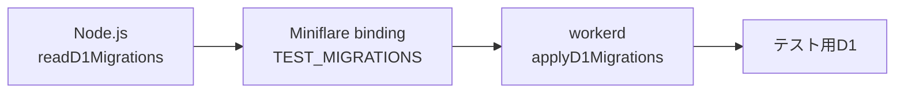

# 概要

Cloudflare Workers上で動くAPIをテストするとき、D1やDurable Objectsを単純なモックへ置き換えると、本番ランタイム固有の挙動を見落とすことがあります。

そこで、Hono・D1・Durable Objectsを組み合わせたAPIに対して、Cloudflare公式のVitest integrationを使い、**workerd上で実際のバインディングを動かすテスト環境**を構築しました。

この記事では、特にハマりやすかった以下の点をまとめます。

- `cloudflareTest()` を使った新しい設定
- D1マイグレーションの適用
- 外部HTTPのモック
- D1のテストデータ隔離
- Durable Objectの状態隔離
- Node.jsとworkerdの実行環境の違い

> ※この記事では `@cloudflare/vitest-pool-workers` 0.19.0で検証した内容をベースにしています。  
> 現在はパッケージ名が `@cloudflare/vitest-plugin` に変更されています。基本的な設定APIは引き継がれています。

# なぜD1とDurable Objectsをモックしないのか

一般的なWeb APIでは、DBアクセス層をモックしてビジネスロジックだけを高速にテストする方法も有効です。

一方、今回のシステムでは以下が設計の中心でした。

- D1の外部キー・一意制約・トランザクション
- Durable Objectのオブジェクト単位の分離
- Durable Objectの単一スレッド実行とStorageの整合性
- Worker binding経由でのD1・DOアクセス
- workerd上でのRequest / Response処理

これらをモックすると、例えば以下を見逃す可能性があります。

- SQLがD1で実行できない
- マイグレーションと実装が食い違っている
- 外部キー制約に違反している
- Durable ObjectのID指定を間違えている
- Node.jsでは動くがWorkersでは動かないAPIを使用している

そのため今回は、単体テストというより**Workersランタイム上で行う軽量な結合テスト**として構築しました。

# `cloudflareTest()` を使う

Vitest 4対応以降、従来の `defineWorkersConfig()` ではなく、Vite Pluginの `cloudflareTest()` を使用します。

```ts
import {
  cloudflareTest,
  readD1Migrations,
} from '@cloudflare/vitest-pool-workers'
import { defineConfig } from 'vitest/config'

const migrations = await readD1Migrations('migrations')

export default defineConfig({
  plugins: [
    cloudflareTest({
      wrangler: {
        configPath: './wrangler.jsonc',
      },
      miniflare: {
        bindings: {
          TEST_MIGRATIONS: migrations,
        },
      },
    }),
  ],
  test: {
    setupFiles: ['./src/test-support/setup.ts'],
  },
})
```

現在の `@cloudflare/vitest-plugin` を使う場合も基本的な考え方は同じです。

# D1マイグレーションは2つのランタイムをまたぐ

ここが特に分かりにくいポイントでした。

| 処理 | 実行環境 |
| --- | --- |
| `vitest.config.ts` | Node.js |
| テスト / setupFiles / Worker | workerd |

Workersには `node:fs` の互換APIがありますが、ホストPC上の任意の `migrations/` ディレクトリを直接読むためのものではありません。

そのため、マイグレーションはNode.js側で読み込み、binding経由でworkerdへ渡します。


```mermaid
graph LR
  A["Node.js<br>readD1Migrations"] --> B["Miniflare binding<br>TEST_MIGRATIONS"]
  B --> C["workerd<br>applyD1Migrations"]
  C --> D["テスト用D1"]
```

Node.js側：

```ts
const migrations = await readD1Migrations('migrations')
```

bindingとして渡します。

```ts
cloudflareTest({
  miniflare: {
    bindings: {
      TEST_MIGRATIONS: migrations,
    },
  },
})
```

workerd側で適用します。

```ts
import { applyD1Migrations } from 'cloudflare:test'
import { env } from 'cloudflare:workers'

await applyD1Migrations(env.DB, env.TEST_MIGRATIONS)
```

`applyD1Migrations()` は未適用のマイグレーションだけを順番に実行します。

デフォルトの管理テーブル名は `d1_migrations` です。

# テスト専用bindingの型を追加する

現在のAPIに合わせるなら、`cloudflare:workers` の `ProvidedEnv` を拡張する方法が分かりやすいです。

```ts
import type { D1Migration } from '@cloudflare/vitest-pool-workers'

declare module 'cloudflare:workers' {
  interface ProvidedEnv {
    TEST_MIGRATIONS: D1Migration[]
  }
}
```

`@cloudflare/vitest-plugin` を利用する場合は、テスト用 `tsconfig.json` に公式の型定義を追加しておくと安全です。

# `fetchMock` は新APIでは使わない

以前は以下のようなAPIがありました。

```ts
import { fetchMock } from 'cloudflare:test'
```

Vitest 4対応の新しいAPIでは `fetchMock` は削除されています。

単純なケースであれば、`globalThis.fetch` をVitestで直接モックできます。

```ts
import { afterEach, vi } from 'vitest'

afterEach(() => {
  vi.restoreAllMocks()
})

vi.spyOn(globalThis, 'fetch').mockImplementation(
  async (input, init) => {
    const request = new Request(input, init)

    if (
      request.url === 'https://example.com/.well-known/jwks.json' &&
      request.method === 'GET'
    ) {
      return Response.json({
        keys: [jwk],
      })
    }

    throw new Error(
      `テストが想定していない外部fetch: ${request.url}`,
    )
  },
)
```

モック対象以外を黙って実通信させないのがポイントです。

現在のCloudflare公式ドキュメントでは、より複雑なHTTPモックには `@msw/cloudflare` の利用も推奨されています。

今回は、

- 外部HTTPだけモックする
- D1とDurable Objectsはworkerd上のbindingを使う

という構成にしました。

# D1をテストごとにリセットする

同じテストファイル内ではDBの状態が次のテストへ残る可能性があります。

そこで `beforeEach()` で対象テーブルを削除します。

```ts
const TABLES_CHILD_FIRST = [
  'child_links',
  'child_records',
  'parent_records',
] as const

export async function resetD1() {
  await env.DB.batch(
    TABLES_CHILD_FIRST.map((table) =>
      env.DB.prepare(`DELETE FROM ${table}`),
    ),
  )
}
```

外部キーがある場合は、**子テーブルから親テーブルの順番**で削除します。

```ts
beforeEach(async () => {
  await resetD1()
})
```

Cloudflareにはbindingの状態をまとめて削除する `reset()` もあります。

```ts
import { reset } from 'cloudflare:test'

afterEach(async () => {
  await reset()
})
```

すべてのbindingを初期化したい場合はこちらが便利です。

D1だけ削除したい場合やマスターデータを残したい場合は、個別のリセット処理の方が制御しやすくなります。

# Durable Objectはテストごとに別IDを使う

Durable ObjectはIDごとに独立しています。

そのため、テストごとに異なる名前を使えば状態を簡単に分離できます。

```ts
function createTestStub() {
  const name = `test-${crypto.randomUUID()}`

  const id =
    env.MY_DURABLE_OBJECT.idFromName(name)

  return env.MY_DURABLE_OBJECT.get(id)
}
```

```ts
it('レコードを作成できる', async () => {
  const stub = createTestStub()

  const result = await stub.createRecord({
    name: 'テストレコード',
  })

  expect(result.name).toBe('テストレコード')
})
```

DO Storageを毎回削除するよりも、単純なテストでは新しいIDを使う方が扱いやすいです。

一方、

- DO再起動
- 永続化されたStorageの復元

などを検証する場合は、同じIDを使いながら `evictDurableObject()` や `runInDurableObject()` を利用できます。

# `npx tsc` で別パッケージが入る罠

プロジェクトにTypeScriptが入っていない状態で、

```bash
npx tsc --noEmit
```

を実行すると、TypeScriptではない同名パッケージを取得してしまうことがあります。

その場合、

```text
This is not the tsc command you are looking for
```

のようなメッセージが出ます。

TypeScriptを明示的に追加します。

```bash
pnpm add -D typescript
```

その後は、

```bash
pnpm exec tsc --noEmit
```

または `package.json` に、

```json
{
  "scripts": {
    "typecheck": "tsc --noEmit"
  }
}
```

を定義して、

```bash
pnpm typecheck
```

と実行する方が安全です。

# 最終的な構成

```text
vitest.config.ts
 ├─ cloudflareTest()
 ├─ wrangler.jsoncを読み込む
 ├─ readD1Migrations()
 └─ TEST_MIGRATIONS bindingを追加

src/test-support/setup.ts
 └─ applyD1Migrations()

src/test-support/env.d.ts
 └─ テスト専用Envの型を追加

src/test-support/reset-d1.ts
 └─ D1のテストデータを削除

各テスト
 ├─ Miniflare / workerd上のD1 bindingを使用
 ├─ Durable Objectはテストごとに別IDを使用
 └─ 外部HTTPのみモック
```

# まとめ

今回一番ややこしかったのは、APIそのものよりも、**どの処理がどのランタイムで動いているのかを整理すること**でした。

- `vitest.config.ts` はNode.js
- テストコードとWorkerはworkerd
- D1マイグレーションはNode.js側で読み込む
- 読み込んだ内容をbindingでworkerdへ渡す
- D1・Durable ObjectsはMiniflare / workerd上のbindingを利用する
- 外部HTTPだけをモックする
- D1は明示削除または `reset()` で初期化する
- Durable Objectは別IDを使って状態を分離する

Cloudflare Workersのテストでは、すべてをモックするのではなく、**Cloudflare固有の部分はworkerd上で実際に動かし、外部境界だけをモックする**構成が扱いやすいと感じました。

# 参考資料

- https://developers.cloudflare.com/workers/testing/vitest-integration/
- https://developers.cloudflare.com/workers/testing/vitest-integration/configuration/
- https://developers.cloudflare.com/workers/testing/vitest-integration/test-apis/
- https://developers.cloudflare.com/workers/testing/vitest-integration/recipes/
- https://developers.cloudflare.com/workers/testing/vitest-integration/migration-guides/migrate-to-vitest-plugin/
- https://developers.cloudflare.com/workers/runtime-apis/nodejs/fs/
- https://github.com/cloudflare/workers-sdk/
- https://vitest.dev/guide/mocking/globals