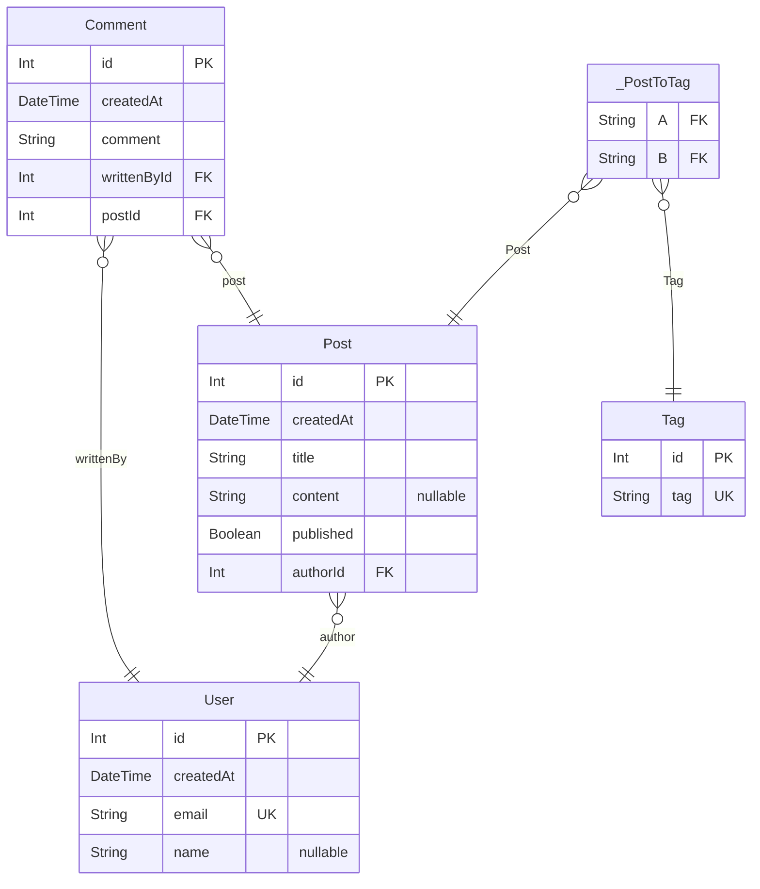

# 概要

PrismaのSchemeをMermaid ERD diagramsで生成してくれるツール `prisma-markdown` を見つけたので試してみたいと思います。

https://github.com/samchon/prisma-markdown

# インストール

- npm

```bash
npm i -D prisma-markdown
```

- yarn

```bash
yarn add -D prisma-markdown
```

# 早速ERDを生成してみる

今回は以下の schema を想定して、生成してみます。

```tsx
model User {
  id        Int       @id @default(autoincrement())
  createdAt DateTime  @default(now())
  email     String    @unique
  name      String?
  comments  Comment[]
  posts     Post[]
}

model Post {
  id        Int       @id @default(autoincrement())
  createdAt DateTime  @default(now())
  title     String
  content   String?
  published Boolean   @default(false)
  authorId  Int
  author    User      @relation(fields: [authorId], references: [id])
  comments  Comment[]
  tags      Tag[]     @relation("TagToPost")
}

model Comment {
  id          Int      @id @default(autoincrement())
  createdAt   DateTime @default(now())
  comment     String
  writtenById Int
  postId      Int
  writtenBy   User     @relation(fields: [writtenById], references: [id])
  post        Post     @relation(fields: [postId], references: [id], onUpdate: NoAction)
}

model Tag {
  id    Int    @id @default(autoincrement())
  tag   String @unique
  posts Post[] @relation("TagToPost")
}
```

次に `schema.prisma` に👇を追加します。

```tsx
generator markdown {
  provider = "prisma-markdown"
  output   = "./ERD.md"
  title    = "TITLE"
}
```

次に以下コマンドで `ERD.md` を生成します。

```bash
npx prisma generate
```

実行すると👇内容で `prisma/ERD.md` が作成されました 🎉



:::details markdown全体

```markdown
# TITLE
> Generated by [`prisma-markdown`](https://github.com/samchon/prisma-markdown)

- [default](#default)

## default

erDiagram
"User" {
  Int id PK
  DateTime createdAt
  String email UK
  String name "nullable"
}
"Post" {
  Int id PK
  DateTime createdAt
  String title
  String content "nullable"
  Boolean published
  Int authorId FK
}
"Comment" {
  Int id PK
  DateTime createdAt
  String comment
  Int writtenById FK
  Int postId FK
}
"Tag" {
  Int id PK
  String tag UK
}
"_PostToTag" {
  String A FK
  String B FK
}
"Post" }o--|| "User" : author
"Comment" }o--|| "User" : writtenBy
"Comment" }o--|| "Post" : post
"_PostToTag" }o--|| "Post" : Post
"_PostToTag" }o--|| "Tag" : Tag


### `User`

**Properties**
  - `id`: 
  - `createdAt`: 
  - `email`: 
  - `name`: 

### `Post`

**Properties**
  - `id`: 
  - `createdAt`: 
  - `title`: 
  - `content`: 
  - `published`: 
  - `authorId`: 

### `Comment`

**Properties**
  - `id`: 
  - `createdAt`: 
  - `comment`: 
  - `writtenById`: 
  - `postId`: 

### `Tag`

**Properties**
  - `id`: 
  - `tag`: 

### `_PostToTag`
Pair relationship table between [Post](#Post) and [Tag](#Tag)

**Properties**
  - `A`: 
  - `B`: 
```

:::

※ VSCodeで `ERD.md` を表示させるには👇などの拡張機能が必要です

https://marketplace.visualstudio.com/items?itemName=bierner.markdown-mermaid

# コメント

## namespace

`/// @namespace <name>` とコメントするとダイアグラムをnamespace毎に分割してくれます。

試してに先ほどの `schema.prisma` に `/// @namespace <name>`  を追加してみます。

```tsx
/// @namespace User
model User {
  ...
}

/// @namespace Post
model Post {
  ...
}

/// @namespace Post
model Comment {
  ...
}

/// @namespace Post
model Tag {
  ...
}
```

すると生成されるMarkdownは👇のようになります。


`User` と `Post` で分割されています。

:::details markdown全体

```markdown
# TITLE
> Generated by [`prisma-markdown`](https://github.com/samchon/prisma-markdown)

- [User](#user)
- [Post](#post)

## User

erDiagram
"User" {
  Int id PK
  DateTime createdAt
  String email UK
  String name "nullable"
}


### `User`

**Properties**
  - `id`: 
  - `createdAt`: 
  - `email`: 
  - `name`: 

## Post

erDiagram
"Post" {
  Int id PK
  DateTime createdAt
  String title
  String content "nullable"
  Boolean published
  Int authorId FK
}
"Comment" {
  Int id PK
  DateTime createdAt
  String comment
  Int writtenById FK
  Int postId FK
}
"Tag" {
  Int id PK
  String tag UK
}
"_PostToTag" {
  String A FK
  String B FK
}
"Comment" }o--|| "Post" : post
"_PostToTag" }o--|| "Post" : Post
"_PostToTag" }o--|| "Tag" : Tag


### `Post`

**Properties**
  - `id`: 
  - `createdAt`: 
  - `title`: 
  - `content`: 
  - `published`: 
  - `authorId`: 

### `Comment`

**Properties**
  - `id`: 
  - `createdAt`: 
  - `comment`: 
  - `writtenById`: 
  - `postId`: 

### `Tag`

**Properties**
  - `id`: 
  - `tag`: 

### `_PostToTag`
Pair relationship table between [Post](#Post) and [Tag](#Tag)

**Properties**
  - `A`: 
  - `B`: 
```

:::

## erd / describe

`/// @erd <name>`  と書くとER図のみ表示され、 `/// @describe <name>`  と書くと詳細部分にしか表示されなくなります。

これも先ほどの `schema.prisma` で試してみます。

```tsx
/// @namespace User
model User {
  ...
}

/// @namespace Post
model Post {
  ...
}

/// @erd Post
model Comment {
  ...
}

/// @describe Post
model Tag {
  ...
}

```

👆とコメントする事で `model Comment` はER図のみ、 `model Tag` は詳細のみに表示されるようになります。以下生成されたERDになります。


:::details markdown全体

```markdown
# TITLE
> Generated by [`prisma-markdown`](https://github.com/samchon/prisma-markdown)

- [User](#user)
- [Post](#post)

## User

erDiagram
"User" {
  Int id PK
  DateTime createdAt
  String email UK
  String name "nullable"
}

### `User`

**Properties**
  - `id`: 
  - `createdAt`: 
  - `email`: 
  - `name`: 

## Post

erDiagram
"Post" {
  Int id PK
  DateTime createdAt
  String title
  String content "nullable"
  Boolean published
  Int authorId FK
}
"_PostToTag" {
  String A FK
  String B FK
}
"Comment" {
  Int id PK
  DateTime createdAt
  String comment
  Int writtenById FK
  Int postId FK
}
"_PostToTag" }o--|| "Post" : Post
"Comment" }o--|| "Post" : post

### `Post`

**Properties**
  - `id`: 
  - `createdAt`: 
  - `title`: 
  - `content`: 
  - `published`: 
  - `authorId`: 

### `_PostToTag`
Pair relationship table between [Post](#Post) and [Tag](#Tag)

**Properties**
  - `A`: 
  - `B`: 

### `Tag`

**Properties**
  - `id`: 
  - `tag`: 
```

:::
